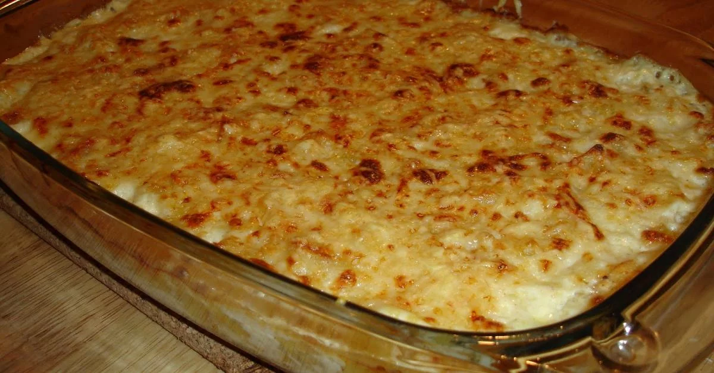

<strong> <u> Bacalhau com natas rápido </u> </strong>

<strong> Ingredientes </strong>

1 embalagem de bacalhau desfiado já demolhado

200 gr de batatas congeladas

1 pacote de natas

1 pacote de bechamel

azeite
1 cebola

1 dente de alho

sal

2 gemas de ovo

<strong> Preparação </strong>

 Num tacho aloure a cebola cortada às rodelas finas e o alho num fio de azeite. Junte o bacalhau e deixe fritar uns minutos.
 Entretanto frite as batatas. Tempere-as de sal e reserve. Assim que o bacalhau estiver cozinhado desligue o lume.
 Coloque num tabuleiro uma camada de batatas, o bacalhau com a cebolada e novamente batatas.
 Entretanto, junte as natas com o bechamel e misture as duas gemas de ovo. Cubra o tabuleiro com esta mistura e leve ao forno a gratinar.

 

 